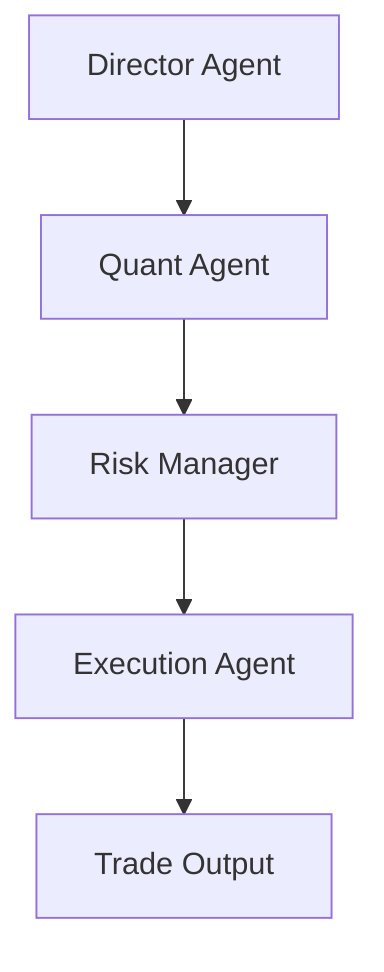

# AutoHedge

[](https://discord.gg/VapjxpSyHC3) [](https://www.youtube.com/@kyegomez3242) [](https://www.linkedin.com/in/kye-g-38759a207/) [](https://x.com/swarms_corp)

AutoHedge is an enterprise-grade autonomous agent hedge fund that trades on your behalf. It now uses a stateless boi architecture: session checkpoints, decision logs, and fill reports are written to disk or repo state, and broker adapters are selected from a shared contract.

Current support: Robinhood and Solana adapters. Robinhood supports stock and crypto routing through the shared broker boi interface.

---

## Setup

### 1. Install dependencies

```bash
cd autohedge
poetry install
```

### 2. Copy env vars

```bash
cp .env.example .env
```

### 3. Configure Robinhood

Set:
- ROBINHOOD_USERNAME
- ROBINHOOD_PASSWORD
- ROBINHOOD_MFA_CODE if your account uses MFA
- ROBINHOOD_SESSION_PICKLE_PATH for persistent login sessions
- ROBINHOOD_STATE_PATH for saved account metadata
- ROBINHOOD_DEVICE_TOKEN optional
- ROBINHOOD_CLIENT_ID optional for direct OAuth-style token exchange

### 4. Run AutoHedge

```bash
autohedge
```

### 5. Select the broker boi

Use the Robinhood adapter through get_broker_boi('robinhood', ...) or from the execution layer that calls the broker factory.

---

## Persistent Robinhood flow

1. The adapter reads Robinhood credentials from env or config.
2. It logs in through the Robinhood client and stores the session pickle path.
3. It persists state to ROBINHOOD_STATE_PATH so the next run can reuse account metadata.
4. Stock and crypto orders are routed through the same broker contract with asset_class='stock' or asset_class='crypto'.
5. Positions, fills, and account snapshots are written back through the same interface.

---

## Architecture

AutoHedge uses a multi-agent pipeline where each agent has a defined responsibility:


